# 📖 دليل المستخدم الشامل لمنظومة إدارة وتصنيع المطابخ وحجرات الملابس (KOSS ERP v2.0)
### شركة بن سوما للمطابخ الحديثة | Ben Gsoma Modern Kitchens & Wardrobes System

---

## 📑 فهرس الدليل

1. [مقدمة ونظرة عامة على المنظومة](#1-مقدمة-ونظرة-عامة-على-المنظومة)
2. [الأدوار والصلاحيات في النظام (Roles & Permissions)](#2-الأدوار-والصلاحيات-في-النظام)
3. [بيانات الدخول وبدء التشغيل (Getting Started)](#3-بيانات-الدخول-وبدء-التشغيل)
4. [دورة حياة المشروع الـ 24 حالة (24-State Workflow Pipeline)](#4-دورة-حياة-المشروع-الـ-24-حالة)
5. [فئات الأعمال الخشبية (مطابخ وحجرات ملابس ودواليب)](#5-فئات-الأعمال-الخشبية)
6. [هندسة وتفكيك العِلَب والباكيات النمطية بالسوق الليبي (Modular Box System)](#6-هندسة-وتفكيك-العِلب-والباكيات-النمطية)
7. [محرك ومصفوفة مقارنة وفروقات الأسعار (Price Variance Engine)](#7-محرك-ومصفوفة-مقارنة-وفروقات-الأسعار)
8. [الدليل الإجرائي لمراحل العمل وشاشات النظام الـ 10](#8-الدليل-الإجرائي-لمراحل-العمل-وشاشات-النظام)
   - [8.1 الاستفسارات والفرص البيعية (CRM & Inquiries)](#81-الاستفسارات-والفرص-البيعية)
   - [8.2 فتح وإدارة طلبات المشاريع (Kitchen Requests)](#82-فتح-وإدارة-طلبات-المشاريع)
   - [8.3 المعاينة الميدانية وفحص الشطرة والقياسات (Site Survey)](#83-المعاينة-الميدانية-وفحص-الشطرة-والقياسات)
   - [8.4 التصاميم ثلاثية الأبعاد وإصدارات المخطط (3D Design Versions)](#84-التصاميم-ثلاثية-الأبعاد-وإصدارات-المخطط)
   - [8.5 هندسة العِلب والتوليد الآلي للوحدات (Modular Breakdown Tab)](#85-هندسة-العِلب-والتوليد-الآلي-للوحدات)
   - [8.6 عروض الأسعار وطرق التسعير الثلاثية (Quotations)](#86-عروض-الأسعار-وطرق-التسعير-الثلاثية)
   - [8.7 العقود وجدول الدفعات وإيصالات القبض (Contracts & Payment Milestones)](#87-العقود-وجدول-الدفعات-وإيصالات-القبض)
   - [8.8 أوامر التشغيل وخطوط الإنتاج وقائمة المواد (Work Orders & BOM)](#88-أوامر-التشغيل-وخطوط-الإنتاج-وقائمة-المواد)
   - [8.9 فحص الجودة والمطابقة الفنية (Quality Control Inspection)](#89-فحص-الجودة-والمطابقة-الفنية)
   - [8.10 التوصيل والتركيب الميداني ومحضر التسليم (Installation & Handover)](#810-التوصيل-والتركيب-الميداني-ومحضر-التسليم)
   - [8.11 مركز التكلفة والربحية الفورية والمصروفات (Project Costing & Profitability)](#811-مركز-التكلفة-والربحية-الفورية-والمصروفات)
   - [8.12 شاشة إعدادات وأسعار المنظومة المركزية (Pricing Settings Dashboard)](#812-شاشة-إعدادات-وأسعار-المنظومة-المركزية)
9. [إدارة المستودعات والخامات وسندات الصرف (Inventory Control)](#9-إدارة-المستودعات-والخامات-وسندات-الصرف)
10. [شروط الإغلاق النهائي الصارمة الـ 9 (9-Condition Closing Gate)](#10-شروط-الإغلاق-النهائي-الصارمة-الـ-9)
11. [إرشادات التشغيل والأسئلة الشائعة (FAQ)](#11-إرشادات-التشغيل-والأسئلة-الشائعة)

---

## 1. مقدمة ونظرة عامة على المنظومة

تم تصميم وتطوير منظومة **KOSS ERP v2.0** لشركة **بن سوما للمطابخ الحديثة وحجرات الملابس** وفق أعلى المعايير المعمارية والصناعية المعتمدة في السوق الليبي. تضمن المنظومة إدارة متكاملة لكافة العمليات الإدارية والفنية والمالية:

```mermaid
graph LR
    A["1. استفسار وعميل"] --> B["2. معاينة وشطرة بالليزر"]
    B --> C["3. تصميم 3D وريندر"]
    C --> D["4. تفكيك العلب والباكيات"]
    D --> E["5. تسعير ومصفوفة فروقات"]
    E --> F["6. عقد رسمي وجدول دفعات"]
    F --> G["7. أمر تشغيل وقائمة BOM"]
    G --> H["8. تصنيع بالمصنع وفحص جودة"]
    H --> I["9. تركيب بموقع العميل"]
    I --> J["10. تسليم نهائي ومخالصة"]
```

---

## 2. الأدوار والصلاحيات في النظام

تعتمد المنظومة على نظام صلاحيات هرمي صارم يحمي مسارات اتخاذ القرار:

| الدور الوظيفي | المهام والمسؤوليات الرئيسية |
| :--- | :--- |
| **الإدارة العليا (Executive)** | الإشراف العام، مراقبة مؤشرات الأداء والربحية، اعتماد الاستثناءات، وإغلاق المشاريع نهائياً. |
| **مسؤول المبيعات (Sales Staff)** | استقبال العملاء، تسجيل الاستفسارات، فتح طلبات المشاريع، وتحرير عروض الأسعار والعقود. |
| **مهندس المساحة (Field Surveyor)** | المعاينة الميدانية، رفع القياسات بالليزر، فحص زوايا الشطرة 90°، وتوثيق نقاط السباكة والكهرباء. |
| **المصمم الداخلي (Designer)** | إعداد المخططات ثلاثية الأبعاد 3D والريندر، حساب الأمتار الطولية وإدارة تعديلات العميل. |
| **مدير المصنع والإنتاج (Production)** | إصدار أمر التشغيل وقائمة المواد (BOM)، ومتابعة خطوط القص والحواف والتجميع وفحص الجودة. |
| **فريق التركيبات (Installation Lead)** | إدارة مواعيد النقل والتركيب بموقع العميل وتوقيع محضر الاستلام والتسليم النهائي. |
| **المسؤول المالي (Finance)** | تحصيل الدفعات، قيد المصروفات المباشرة، وحساب الأرباح الفعلية وهامش الربحية. |

---

## 3. بيانات الدخول وبدء التشغيل

### بيانات الحساب الافتراضي للنظام:
- **الرابط المحلي**: `http://localhost:5050`
- **صفحة تسجيل الدخول**: `http://localhost:5050/Account/Login`
- **البريد الإلكتروني**: `admin@koss.ly`
- **كلمة المرور**: `Admin@123`

---

## 4. دورة حياة المشروع الـ 24 حالة (24-State Workflow Pipeline)

تخضع كافة المشاريع لمحرك سير عمل صارم يمنع التجاوزات الفنية أو المالية:

```mermaid
stateDiagram-v2
    [*] --> 1_NewInquiry: 1. استفسار جديد
    1_NewInquiry --> 2_Qualified: 2. مؤهل للمتابعة
    2_Qualified --> 3_RequestOpened: 3. طلب مفتوح
    3_RequestOpened --> 4_AwaitingSiteVisit: 4. بانتظار المعاينة
    4_AwaitingSiteVisit --> 5_SiteVisitCompleted: 5. تمت المعاينة
    5_SiteVisitCompleted --> 6_InDesign: 6. قيد التصميم 3D
    6_InDesign --> 7_AwaitingDesignApproval: 7. بانتظار اعتماد التصميم
    7_AwaitingDesignApproval --> 8_InPricing: 8. قيد التسعير والتكلفة
    8_InPricing --> 9_QuotationSent: 9. عرض السعر مُرسل
    9_QuotationSent --> 11_QuotationAccepted: 11. تم قبول العرض
    11_QuotationAccepted --> 12_AwaitingContractAndDeposit: 12. بانتظار العقد والعربون
    12_AwaitingContractAndDeposit --> 13_ContractActive: 13. عقد نشط - بدء التشغيل
    13_ContractActive --> 14_InPlanning: 14. تخطيط الخامات وإصدار BOM
    14_InPlanning --> 15_InManufacturing: 15. قيد التصنيع بالمصنع
    15_InManufacturing --> 16_ReadyForInstallation: 16. جاهز للنقل والتركيب
    16_ReadyForInstallation --> 17_InstallationScheduled: 17. جدولة موعد التركيب
    17_InstallationScheduled --> 18_InInstallation: 18. قيد التركيب الميداني
    18_InInstallation --> 20_ReadyForHandover: 20. جاهز للتسليم
    20_ReadyForHandover --> 21_HandoverCompleted: 21. تم التسليم وتوقيع المحضر
    21_HandoverCompleted --> 22_AwaitingFinalBalance: 22. بانتظار سداد المخالصة
    22_AwaitingFinalBalance --> 23_Closed: 23. مشروع مغلق ومكتمل نهائياً
    23_Closed --> [*]
```

---

## 5. فئات الأعمال الخشبية (مطابخ وحجرات ملابس ودواليب)

تدعم المنظومة 4 فئات رئيسية للمشاريع الخشبية:
1. **مطبخ حديث (Modern Kitchen)**: تخطيط خطي، حرف L، حرف U، متوازي، أو مع جزيرة وسطية.
2. **حجرة ملابس (Dressing Room)**:
   - حجرة مفتوحة بدون درف (*Open Walk-in Closet*).
   - دواليب درف سحاب (*Sliding Wardrobe*).
   - دواليب فاخرة بدرف زجاج فاميه وبروفايل ألمنيوم وإضاءة داخلية.
   - حجرة مع جزيرة وسطية لتنظيم الساعات والمجوهرات.
3. **دولاب حائط مدمج (Built-in Wardrobe)**.
4. **مطبخ ودواليب متعددة (Combined)**: للمشاريع الشاملة في الفلل والقصور.

---

## 6. هندسة وتفكيك العِلَب والباكيات النمطية بالسوق الليبي (Modular Box System)

تعتمد المنظومة على التفكيك الهندسي الدقيق لكل مشروع إلى علب ووحدات نمطية:

### أ. عِلب المطابخ الحديثة:
* **العلب السفلية (Base Units - عمق 60 سم / ارتفاع 85 سم)**:
  - **علبة الحوض (`B-SINK`)**: خشب كونتر/Plywood معزول ضد الماء مع تغليف ألمنيوم بدون ظهر.
  - **علبة الأدراج (`B-DRAW`)**: أدراج تاندم بوكس هيدروليك مع تقسيمات ملاعق وقدور.
  - **علبة الزاوية (`B-CORNER`)**: زاوية عمياء مع سلة ذكية سحب كامل (*LeMans / Magic Corner*).
  - **علبة سحب الزيوت والبهارات (`B-SPICE`)**: سلة سحب استانلس بعرض 20 إلى 30 سم.
* **العلب العلوية (Wall Units - عمق 35 سم / ارتفاع 70 - 90 سم)**:
  - **علبة المطبقية (`W-DISH`)**: مصفاة صحون استانلس مع رافعة هيدروليكية مزدوجة (*Blum Aventos HF*).
  - **علبة الشفاط (`W-HOOD`)**: مدمجة مع مسار مدخنة ومحرك الشفاط.
  - **علب السقف (`Loft Cabinets`)**: للوصول إلى السقف بارتفاع 240 إلى 280 سم.
* **الأبراج الطولية (Tall Towers - عمق 60 سم / ارتفاع 220 سم)**:
  - برج الفرن والمايكروويف المدمج ودولاب المؤن (*Pantry Tower*).
* **الجزيرة الوسطية (`Island`)**:
  - جزيرة وجهين وجلسة بار إفطار.

### ب. باكيات وعِلب حجرات الملابس (Dressing Rooms):
* **باكية التعليق الطويل (`DR-LONG`)**: ارتفاع صافي 150 - 160 سم للعبايات والفساتين والجلابيات.
* **باكية التعليق القصير (`DR-SHORT`)**: مستويين تعليق للبدل والقمصان (ارتفاع 100 سم لكل مستوى).
* **باكية الأدراج والساعات (`DR-DRAWERS`)**: أدراج مبطنة بمخمل وزجاج مقسى لعرض الساعات والخواتم.
* **باكية الأحذية والحقائب (`DR-SHOES`)**: أرفف مائلة مع حواجز استانلس لحفظ الأحذية والحقائب.
* **جزيرة الدريسنج روم الوسطية (`DR-ISLAND`)**: مع سطح زجاجي ووحدات سحب هيدروليكية.

---

## 7. محرك ومصفوفة مقارنة وفروقات الأسعار (Price Variance Engine)

يوفر النظام داخل كل مشروع مصفوفة فورية توضح للعميل والإدارة **فروقات وتفاوت التكلفة داخل نفس المطبخ أو الغرفة**:

### 1. مصفوفة مقارنة خامات الدرف والواجهات:
| الخامة | الوصف الفني | سعر المتر التقديري | الفارق المالي عن الأكريليك | التصنيف |
| :--- | :--- | :---: | :---: | :---: |
| **ميلامين / فورميكا (HPL)** | اقتصادي ومتين ومقاوم للخدش العادي | 750 د.ل | -350 د.ل (توفير) | الخيار الاقتصادي |
| **أكريليك عالي اللمعان (Acrylic)** | لمعان زجاجي فائق 95 Gloss ومقاوم للبخار | 1,100 د.ل | 0 د.ل | **الأكثر طلباً (الأساس)** |
| **بولي لاك وسوبر مات (Polylac)** | معالجة حرارية مقاومة للبصمات والحرارة | 1,350 د.ل | +250 د.ل | فاخر وعصري |
| **زجاج بإطار بروفايل ألمنيوم وليد** | زجاج سموكي عاكس فخم مع إضاءة لكل رف | 1,750 د.ل | +650 د.ل | VIP فندقي راقٍ |

### 2. مصفوفة فروقات الإكسسوارات والميكانيزم الهيدروليكي:
* **مفصلات بلوم النمساوية (Blum Soft-Close)**: إغلاق صامت وسلس مدى الحياة (+85 د.ل للعلبة).
* **رافعة أبواب علوية مزدوجة (Blum Aventos HF/HK)**: تفتح الدرف للأعلى بدون إعاقة الرأس (+420 د.ل للعلبة).
* **سلة الزاوية الذكية (Magic Corner / LeMans)**: استغلال الزاوية الميتة بسحب كامل للخارج (+850 د.ل).
* **منظم ساعات ومجوهرات مخملي زجاجي**: لدواليب الملابس والجزيرة (+260 د.ل).

### 3. مصفوفة أسطح العمل (الرخام والكوارتز):
* **رخام صناعي أكريليك (Solid Surface)**: سطح متصل بدون فواصل ظاهرة (450 د.ل/م).
* **كوارتز ألماني/تركي (Quartz)**: صلابة فائقة 93% حجر طبيعي ومقاومة للسكاكين والبقع (680 د.ل/م).
* **بورسلان مضغوط (Dekton)**: مقاوم للحرارة المباشرة والنار وأقوى درجات الصلابة (950 د.ل/م).
* **جرانيت طبيعي (جلاكسي دبل بلاك)**: لمعان طبيعي كلاسيكي أسود ملكي (550 د.ل/م).

---

## 8. الدليل الإجرائي لمراحل العمل وشاشات النظام

### 8.1 الاستفسارات والفرص البيعية (Inquiries)
تسجيل بيانات العميل، نوع العقار، والمنتج المطلوب (مطبخ أو حجرة ملابس)، والتحويل بنقرة واحدة لطلب مطبخ رسمي.

### 8.2 فتح وإدارة طلبات المشاريع (Kitchen Requests)
- تحديد فئة العمل (`CarpentryCategory`) وتخطيط المطبخ/الغرفة.
- تعيين موظف المبيعات وتاريخ التسليم المستهدف.

### 8.3 المعاينة الميدانية وفحص الشطرة والقياسات (Site Survey)
- تسجيل أطوال الجدران الرئيسية الثلاثة وارتفاع السقف.
- **فحص زاوية الشطرة (Corner Angle 90°)** والتأكد من استقامة الجدران.
- تسجيل **ارتفاع جلسة النوافذ** ومواقع السباكة والأفياش الكهربائية المدمجة.

### 8.4 التصاميم ثلاثية الأبعاد وإصدارات المخطط (3D Design Versions)
- إدارة الإصدارات المتعددة (`V1, V2`).
- حساب الأمتار الطولية واعتماد العميل الرسمي لقفل التصميم.

### 8.5 هندسة العِلب والتوليد الآلي للوحدات (Modular Breakdown Tab)
- استعراض كشف العلب المسجلة بالمشروع.
- **زر التوليد الآلي**: يدرج كشف العلب المعتمدة آلياً باحتساب تكاليفها وسعر بيعها فوراً.
- إمكانية إضافة علبة مخصصة جديدة أو حذف أي علبة.

### 8.6 عروض الأسعار وطرق التسعير الثلاثية (Quotations)
- دعم التسعير بـ:
  1. **المتر الطولي (Running Meter)** للمطابخ.
  2. **المتر المربع (Square Meter)** لحجرات الملابس والدووليب.
  3. **التسعير التجميعي بالعلبة (Modular Box Pricing)** وهو الأدق صناعياً.

### 8.7 العقود وجدول الدفعات الرباعي (Contracts & Payments)
1. **عربون التعاقد (30%)**: عند توقيع العقد لبدء حجز الخامات.
2. **دفعة بدء التصنيع (40%)**: عند قص وتجميع الهياكل في المصنع.
3. **دفعة الجاهزية للتركيب (20%)**: عند توريد المطبخ لموقع العميل.
4. **مخالصة التسليم (10%)**: بعد انتهاء التركيب وتوقيع محضر التسليم.

### 8.8 أوامر التشغيل وخطوط الإنتاج وقائمة المواد (Work Orders & BOM)
تفكيك قائمة المواد المحجوزة آلياً لكل علبة (ألواح خشب، أشرطة حواف PVC، مفصلات، ومجاري).

### 8.9 فحص الجودة والمطابقة الفنية (Quality Inspection)
فحص استقامة الأبعاد، جودة شريط الحواف بغراء PUR، وحركة المفصلات قبل السماح بخروج الشحنة.

### 8.10 التوصيل والتركيب الميداني ومحضر التسليم (Installation & Handover)
جدولة موعد التركيب وتوقيع محضر التسليم النهائي مع العميل وتوثيق النواقص إن وجدت.

### 8.11 مركز التكلفة والربحية الفورية (Costing & Profitability)
$$\text{صافي الربح الفعلي} = \text{إيراد العقد} - (\text{تكلفة المواد} + \text{المصروفات المباشرة} + \text{أجور النقل والتركيب})$$

### 8.12 شاشة إعدادات وأسعار المنظومة المركزية (Pricing Settings Dashboard)
توفر المنظومة للمدير العام ومسؤولي المبيعات لوحة تحكم ديناميكية مركزية عبر الرابط (`/PricingSettings`)، للتحكم في كافة أسعار الخامات، الأمتار، الإكسسوارات، ونسب الأرباح وتحديثها فورياً في قاعدة البيانات دون تعديل كود برمجي:
- **أسعار المتر الأساسية (Base Meter Rates)**: تحديد سعر المتر الطولي للمطابخ والمتر المربع لحجرات الملابس (أكريليك عالي اللمعان 1,100 د.ل/م، بولي لاك 1,350 د.ل/م، ميلامين HPL اقتصادي 750 د.ل/م، كلادينج ألمنيوم 900 د.ل/م، درف زجاج سموكي وبروفايل ولد 1,750 د.ل/م، ودواليب الملابس 650 د.ل/م²).
- **تكاليف خامات شاسيه العلب (Carcass Costs)**: شاسيه أبيض داخلي (180 د.ل)، خشب كونتر Plywood معزول ضد الماء للعلب السفلية والأحواض (280 د.ل)، وشاسيه رمادي/كتان ألماني عصري (220 د.ل).
- **تكاليف تشطيبات الدرف والواجهات (Door Finish Costs)**: درف الأكريليك (150 د.ل)، البولي لاك (210 د.ل)، الميلامين (90 د.ل)، وبروفايل الزجاج الألمنيوم (320 د.ل).
- **أسعار الإكسسوارات والميكانيزم الهيدروليكي (Hardware & Mechanisms)**: مفصلات بلوم النمساوية Soft-Close (85 د.ل)، روافع الأبواب العلوية Blum Aventos HF/HK (420 د.ل)، سلال الزاوية الذكية Magic Corner (850 د.ل)، ومنظم الساعات والمجوهرات (260 د.ل).
- **أسعار أسطح العمل (Countertops Rates)**: الرخام الصناعي الأكريليكي (450 د.ل/م)، الكوارتز الألماني والتركي (680 د.ل/م)، أسطح الديكتون والبورسلان المضغوط (950 د.ل/م)، والجرانيت الطبيعي (550 د.ل/م).
- **نسبة هامش الربح الافتراضية (Default Profit Margin %)**: نسبة ربح الشركة المستهدفة (افتراضياً 25%)، حيث تنعكس تلقائياً في حساب سعر البيع المقترح لأي علبة أو مقايسة.
- **زر إعادة الضبط للقيم الافتراضية (Reset to Defaults)**: استعادة الأسعار المعتمدة القياسية للسوق الليبي بنقرة زر واحدة عند الحاجة.

---

## 9. إدارة المستودعات والخامات وسندات الصرف

- مراقبة الأرصدة الثلاثية:
  - **الرصيد الفعلي**: الكمية الموجودة بأرض المستودع.
  - **الرصيد المحجوز**: الكميات المخصصة لأوامر تشغيل معتمدة.
  - **الرصيد المتاح**: الكميات المتبقية للطلبات الجديدة.
- إصدار سندات صرف الخامات المحملة مباشرة على مركز تكلفة المشروع.

---

## 10. شروط الإغلاق النهائي الصارمة الـ 9 (9-Condition Closing Gate)

> [!IMPORTANT]
> **يمنع النظام أرشفة وإغلاق أي مشروع حتى يتم استيفاء الشروط الـ 9 التالية بالكامل:**
> 1. ✅ وجود معاينة ميدانية معتمدة وفحص شطرة الجدران.
> 2. ✅ وجود تصميم 3D معتمد ومقفل من العميل.
> 3. ✅ وجود عرض سعر رسمي مقبول.
> 4. ✅ وجود عقد رسمي سارٍ ونشط.
> 5. ✅ سداد كامل قيمة العقد (المتبقي = 0 د.ل).
> 6. ✅ اكتمال كافة مراحل التصنيع في المصنع بنسبة 100%.
> 7. ✅ اجتياز فحص الجودة والمطابقة بنجاح.
> 8. ✅ اكتمال التركيب الميداني في موقع العميل.
> 9. ✅ توقيع محضر التسليم النهائي بدون نواقص معلقة.

---

## 11. إرشادات التشغيل والأسئلة الشائعة (FAQ)

### س 1: كيف أغير نوع المشروع من مطبخ إلى حجرة ملابس (Dressing Room)؟
> **ج**: عند فتح الطلب في شاشة `/Requests/Create`، اختر من حقل "فئة العمل" الخيار "حجرة ملابس (Dressing Room)"، وسيتم آلياً تكييف تخطيطات الغرفة والعلب النمطية لتشمل باكيات التعليق وأدراج الساعات والأحذية.

### س 2: كيف أستفيد من ميزة "توليد العلب النمطية تلقائياً"؟
> **ج**: من شاشة تفاصيل المشروع (`/Requests/Details/{id}`)، انتقل إلى تبويب **"هندسة العِلَب والأسعار"** واضغط على زر **"توليد باقة العلب النمطية تلقائياً"**، ليقوم النظام بإدراج العلب النموذجية واحتساب تكلفتها فوراً.

### س 3: أين تظهر فروقات الأسعار للعميل؟
> **ج**: تظهر مباشرة أسفل جدول العلب في تبويب "هندسة العِلب"، حيث يولد النظام 3 جداول مقارنة فورية (فروقات خامات الدرف، فروقات ميكانيزم بلوم وأفينتوس، وفروقات الرخام والكوارتز).

---

> **شركة بن سوما للمطابخ الحديثة وحجرات الملابس | Ben Gsoma Modern Kitchens**  
> الدليل التشغيلي المعتمد - نسخة 2026
